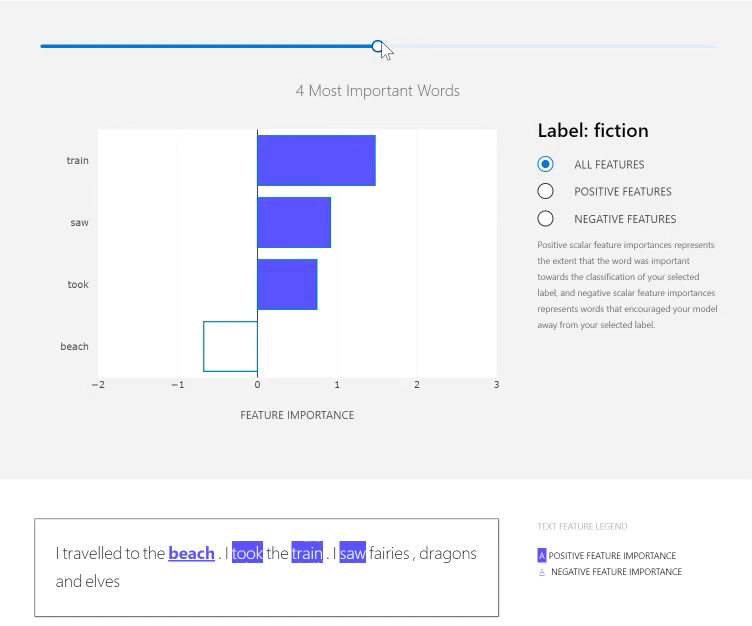

# Interpret Community Text SDK
The Interpret Community Text builds on [Interpret-Community](https://github.com/interpretml/interpret-community), an open source python package for training interpretable models and helping to explain blackbox machine learning systems. We have added extensions to support text models.

This repository contains an SDK and Jupyter notebooks with examples to showcase its use.

# Contents

-  [Overview of Interpret-Text](#overview)
-  [Target Audience](#target-audience)
-  [Getting Started](#getting-started)
-  [Supported Models and NLP Scenarios](#models)
-  [Supported Explainers](#explainers)
-  [Use Interpret-Text](#use)
-  [Contributing](#contrib)
-  [Code of Conduct](#code)

<a  name="overview"></a>

# Overview of Interpret-Text
Interpret-Text incorporates community developed interpretability techniques for NLP models and a visualization dashboard to view the results. Users can run their experiments across multiple state-of-the-art explainers and easily perform comparative analysis on them. Using these tools, users will be able to explain their machine learning models globally on each label, or locally for each document. In particular, this open-source toolkit:
1. Actively incorporates innovative text interpretability techniques, and allows the community to further expand it's offerings
2. Creates a common API across the integrated libraries
3. Provides an interactive visualization dashboard to empower its users to gain insights into their data

<a  name="target-audience"></a>

# Target Audience

1. Developers/Data Scientists: Having all of the interpretability techniques in one place makes it easy for data scientists to experiment with different interpretability techniques, and explain their model in a scalable and seamless manner. The set of rich interactive visualizations allow developers and data scientists to train and deploy more transparent machine learning models instead of wasting time and effort on generating customized visualizations, addressing scalability issues by optimizing third-party interpretability techniques, and adopting/operationalizing interpretability techniques.

2. Business Executives: The core logic and visualizations are beneficial for raising awareness among those involved in developing AI applications, allow them to audit model predictions for potential unfairness, and establish a strong governance framework around the use of AI applications.

3. Machine Learning Interpretability Researchers: Interpret's extension hooks make it easy to extend and thus, interpretability researchers who are interested in adding their own techniques, can easily add them to the community repository and compare it to state-of-the-art and proven interpretability techniques and/or other community techniques.


<a  name="getting-started"></a>

# Getting Started

This repository uses Anaconda to simplify package and environment management.

To setup on your local machine:

<details>

<summary><strong><em>1. Clone the interpret-community repository</em></strong></summary>

Clone and cd into the repository
```
git clone https://github.com/microsoft/interpret-community-text.git
cd interpret-community-text
```
</details>

<details><summary><strong><em>2. Set up Environment</em></strong></summary>

    a. Install Anaconda with Python >= 3.7 
       [Miniconda](https://conda.io/projects/conda/en/latest/user-guide/install/index.html) is a quick way to get started.


<details><summary><strong><em>2.1 Create and activate conda environment (For CPU): </strong></em></summary>

```
    python tools/generate_conda_files.py
    conda env create -n interpret_cpu --file=interpret_cpu.yaml
    conda activate interpret_cpu
```
</details>

<details><summary><strong><em>2.2 Create and activate conda environment (For GPU): </em></strong></summary>

```
    python tools/generate_conda_files.py --gpu
    conda env create -n interpret_gpu --file=interpret_gpu.yaml
    conda activate interpret_gpu
```
</details>
</details>

<details>
<summary><strong><em>3. Install package </em></strong></summary>

You can install the package from source or from pipy.

<details><summary><strong><em>3.1 From source (developers): </strong></em></summary>

```
    pip install -e .
```
</details>

<details><summary><strong><em>3.2 From pipy (package users): </strong></em></summary>

```
    pip install keyring artifacts-keyring
    pip install interpret-text --index-url "https://pkgs.dev.azure.com/responsibleai/_packaging/responsibleai/pypi/simple" (placehodler)
```
</details>

</details>

<details>
<summary><strong><em>4. Set up and run Jupyter Notebook server </em></strong></summary>

Install and run Jupyter Notebook
```
    pip install notebook
    jupyter notebook
```
</details>

# <a name="models"></a>

# Supported NLP Scenarios

 Currently this repository provides support for the the text classification scenario.
# <a name="explainers"></a>

# Supported Explainers
The following is a list of the explainers available in this repository:
* Classical Text Explainer - (Default: [Bag-of-words](https://en.wikipedia.org/wiki/Bag-of-words_model) with Logistic Regression)

* [MSR-Asia](https://www.microsoft.com/en-us/research/publication/towards-a-deep-and-unified-understanding-of-deep-neural-models-in-nlp/): uses an information-based measure to provide explanations on the intermediate layers of deep NLP models

## Classical Text Explainer

The ClassicalTextExplainer extends text explainability to classical machine learning models. 
[This](notebooks/text_classification/text_classification_mnli_bow_lr.ipynb) notebook provides a step by step walkthrough of operationalizing the ClassicalTextExplainer in an ML pipeline.

### Preprocessing and the Pipeline

The ClassicalTextExplainer serves as a high level wrapper for the entire NLP pipeline, by natively handling the text preprocessing, encoding, training and hyperparameter optimization process. 
This allows the user to simply supply the dataset in text form without need for any external processing, with the entire text pipeline process being handled by the explainer under the hood.                         

In its default configuration the preprocessing pipeline uses a 1-gram bag-of-words encoder implemented by sklearn's count-vectorizer. The [utilities](python/interpret_text/common/utils_classical.py) file contains the finer details of the preprocessing steps in the default pipeline.            

### Supported Models

the ClassicalTextExplainer natively supports 2 families of models. Namely, 

* Linear models with support for a '*coefs_*' call under sklearn's linear_model module 
* Tree based models with a 'feature_importances' call under sklearn's ensemble module  

In the absence of a user supplied model, the ClassicalTextExplainer defaults to sklearn's logistic regression.
In addition to the above mentioned models, any model that follows the same API layout and is compatible with sparse representations as input will also be supported.
Apart from Logistic regression, we have successfully tested the framework with [LightGBM](https://github.com/microsoft/LightGBM) and Random Forests as well.

### Extensibility and Modularity:

The ClassicalTextExplainer has been designed with explicit intent of being modular and extensible.

The API allows for users to swap out nearly every component, including the preprocessor, tokenizer, model and even training routine, with varying levels of difficulty. The API is composed such that a modified explainer would still be able to leverage the rest of the tooling implemented within the package.

The text encoding and decoding components are both closely tied to each other. Should the user wish to use a custom encoding process, it has to come paired with its own custom decoding process.

### Explainability:

The ClassicalTextExplainer offers a painfree API to surface explainations inherent to supported models. The natively supported linear models such as linear regression and logisitic regression are considered to be glass-box explainers. A glass-box explainer implies a model that is innately explainable, where the user can fully observe and dissect the process adopted by the model in making a prediction. The family of linear models such as logistic regression and ensemble methods like random forests can be considered to under the umbrella of glass-box explainers. Neural networks and Kernel based models are usually not considered glass-boxes.

By default, the ClassicalTextExplainer leverages this inherent explainability by exposing weights and importances over encoded tokens as explanations over each word in a document. In practice, these can be accessed through the visualization dashboard or the explanation object.

The explanations provided by the aforementiond glass-box methods serve as direct proxies for weights and parameters in the model, which make the final prediction. This allows us to have high confidence in the correctness of the explanation and strong belief in humans being able to understand the internal configuration of the trained machine learning model.

If the user supplies a custom model, the nature of their model explanability (glass-box , grey-box, black-box) will carry over to importances spit out by the explainer as well.

<a  name="use"></a>

# Use Interpret-Text

## Interpretability in training

1. Train your model in a Jupyter notebook running on your local machine. For a sample pipelines see [nlp-recipes](https://github.com/microsoft/nlp-recipes/blob/master/examples/text_classification/tc_mnli_transformers.ipynb) or our [sample notebook](https://github.com/microsoft/interpret-community-text/blob/master/notebooks/text_classification/text_classification_mnli_bert.ipynb)

2. Call the explainer: To initialize the explainers, you will need to pass either 1. the dataset or 2. your model, dataset and other information depending on which explainer you are using.
To initialize the `UnifiedInformationExplainer`, pass the model, the dataset you used to train the model along with the CUDA device and the target layer.

    ```python
    from interpret_text.unified_information.unified_information_explainer import UnifiedInformationExplainer

    interpreter_unified = UnifiedInformationExplainer(model, 
                                     train_dataset, 
                                     device, 
                                     target_layer)
    ```

    If you intend to use the `ClassicalTextExplainer` with our default Linear Regression model, you can simply call the fit function with your dataset.
    ```python
    from sklearn.preprocessing import LabelEncoder
    from interpret_text.classical.classical_text_explainer import ClassicalTextExplainer

    explainer = ClassicalTextExplainer()
    label_encoder = LabelEncoder()
    classifier, best_params = explainer.fit(X_train, y_train)
    ```
    Instead, if you want to use the `ClassicalTextExplainer` with your own sklearn model. You will need to initialize `ClassicalTextExplainer` with your model, preprocessor and the range of hyperparamaters.
    ```python
    from sklearn.preprocessing import LabelEncoder
    from interpret_text.classical.classical_text_explainer import ClassicalTextExplainer
    from interpret_text.common.utils_classical import get_important_words, BOWEncoder

    HYPERPARAM_RANGE = {
        "solver": ["saga"],
        "multi_class": ["multinomial"],
        "C": [10 ** 4],
    }
    preprocessor = BOWEncoder()
    explainer = ClassicalTextExplainer(preprocessor, model, HYPERPARAM_RANGE)
    ```
## Instance-level (local) feature importance values
Get the local feature importance values: use the following function calls to explain an individual instance or a group of instances. 

```python
# explain the first data point in the test set
local_explanation = explainer.explain_local(x_test[0])

# sorted feature importance values and feature names
sorted_local_importance_names = local_explanation.get_ranked_local_names()
sorted_local_importance_values = local_explanation.get_ranked_local_values()
```

## Visualization Dashboard

### Initializing the `ExplanationDashboard` object

1. In order to use the visualization dashboard, first you will need to import the `ExplanationDashboard` object from the package.

    ```python
    from interpret_text.widget import ExplanationDashboard
    ```
2. When initializing the ExplanationDashboard, you will need to pass the local explanation object that is returned by our explainer.

    ```python
    ExplanationDashboard(local_explanantion)
    ```
    Note: if you are not using one of our explainers, you will need to create your own explanation object by passing the feature importance values
    ```python
    from interpret_text.explanation.explanation import _create_local_explanation
    
    local_explanantion = _create_local_explanation(
    classification=True,
    text_explanation=True,
    local_importance_values=feature_importance_values,
    method=name_of_model,
    model_task="classification",
    features=parsed_sentence_list,
    classes=list_of_classes,
    )
    ```
### Using the Dashboard 
The dashboard visualizes the local feature importances of the document with an interactive bar chart and text area with highlighting and underlining of important words in your document. Words associated with positive feature importance contributed to the classification of the document towards the label indicated on the dashboard, words associated with negative feature importance contributed against it. The cap on number of important words is decided by the total number words with non-zero feature importances. Hovering over either the bars in the chart or the highlighted/underlined words will reveal a tooltip with the numerical feature importance. In the chart tooltip, the context of the word shows both the word before and after to allow users a way to differentiate between the same words used multiple times.



<a  name="contrib"></a>

# Contributing
This project welcomes contributions and suggestions. Most contributions require you to agree to the Github Developer Certificate of Origin, DCO. For details, please visit  [https://probot.github.io/apps/dco/](https://probot.github.io/apps/dco/).

The Developer Certificate of Origin (DCO) is a lightweight way for contributors to certify that they wrote or otherwise have the right to submit the code they are contributing to the project. Here is the full text of the DCO, reformatted for readability:
```
By making a contribution to this project, I certify that:
(a) The contribution was created in whole or in part by me and I have the right to submit it under the open source license indicated in the file; or
(b) The contribution is based upon previous work that, to the best of my knowledge, is covered under an appropriate open source license and I have the right under that license to submit that work with modifications, whether created in whole or in part by me, under the same open source license (unless I am permitted to submit under a different license), as indicated in the file; or
(c) The contribution was provided directly to me by some other person who certified (a), (b) or (c) and I have not modified it.
(d) I understand and agree that this project and the contribution are public and that a record of the contribution (including all personal information I submit with it, including my sign-off) is maintained indefinitely and may be redistributed consistent with this project or the open source license(s) involved.
Contributors sign-off that they adhere to these requirements by adding a Signed-off-by line to commit messages.
This is my commit message

Signed-off-by: Random J Developer <random@developer.example.org>
Git even has a -s command line option to append this automatically to your commit message:
$ git commit -s -m 'This is my commit message'
```
When you submit a pull request, a DCO bot will automatically determine whether you need to certify. Simply follow the instructions provided by the bot.

<a name=Code></a>
# Code of Conduct

This project has adopted the his project has adopted the  [GitHub Community Guidelines](https://help.github.com/en/github/site-policy/github-community-guidelines).

## Reporting Security Issues

Security issues and bugs should be reported privately, via email, to the Microsoft Security Response Center (MSRC) at  [secure@microsoft.com](mailto:secure@microsoft.com). You should receive a response within 24 hours. If for some reason you do not, please follow up via email to ensure we received your original message. Further information, including the  [MSRC PGP](https://technet.microsoft.com/en-us/security/dn606155)  key, can be found in the  [Security TechCenter](https://technet.microsoft.com/en-us/security/default).
